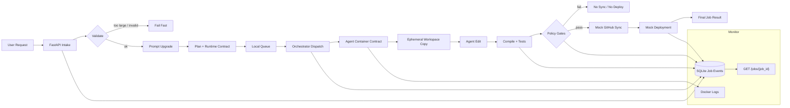

# Cloud Agent Service Local MVP

`cloud_agent_service` is a local-only implementation of the planned cloud coding-agent
platform. It proves the application flow with deterministic local components:
API intake, prompt validation, prompt upgrade, job state, queue/orchestration,
agent execution, tests, policy gates, mock GitHub sync, and mock deployment.

It intentionally does not create AWS resources, push to GitHub, or perform a
real deployment.

## App Flow



## Components

- `app.py`: FastAPI surface for job creation, status, and health checks.
- `pipeline.py`: request validation, prompt upgrade, planning, local repo copy,
  deterministic edit, tests, policy gates, local GitHub sync mock, and local
  deployment mock.
- `store.py`: SQLite job and event persistence.
- `orchestrator.py`: local queue and one-job runner.
- `worker.py`: container-friendly single-job entry point.
- `Dockerfile.api`: API container.
- `Dockerfile.agent`: worker container.
- `compose.yaml`: local API/worker build configuration.
- `AGENTS.md`: operating instructions for coding agents.
- `llm.txt`: compact orientation file for LLM agents.

## What The MVP Proves

1. Receive a user prompt.
2. Reject invalid input before dispatch.
3. Normalize the prompt into a concise implementation brief.
4. Create a durable job record.
5. Queue and dispatch the job.
6. Run the job through a container-compatible worker contract.
7. Copy the target repo into an isolated workspace.
8. Execute a deterministic local coding action.
9. Run tests and policy gates before sync/deploy.
10. Return final status with events, changed files, checks, mock PR URL, and
    mock deployment status.

## Local Run

Compile and test:

```bash
python3 -m compileall . tests/test_cloud_agent_service_flow.py
python3 -m unittest tests.test_cloud_agent_service_flow
python3 -m unittest discover -s tests
```

Run the API with Docker:

```bash
docker --context orbstack compose -f compose.yaml up -d --build api
curl -sS http://127.0.0.1:8000/health
```

Run the API directly, after installing dependencies:

```bash
python3 -m venv .venv
. .venv/bin/activate
python -m pip install -r requirements.txt
uvicorn cloud_agent_service.app:app --reload
```

Stop the Docker stack:

```bash
docker --context orbstack compose -f compose.yaml down
```

## Submit A Job

Against Docker Compose, the host repo is mounted as `/host_repo`:

```bash
curl -X POST http://127.0.0.1:8000/jobs \
  -H 'content-type: application/json' \
  -d '{
    "prompt": "For my shopping website, create a buy button.",
    "repo_path": "/host_repo",
    "deploy_policy": "manual"
  }'
```

Fetch status:

```bash
curl -sS http://127.0.0.1:8000/jobs/<job_id>
```

Monitor containers:

```bash
docker --context orbstack compose -f compose.yaml ps
docker --context orbstack compose -f compose.yaml logs --tail=120 api
```

## Runtime Data

Docker Compose stores runtime data in the `runtime_data` Docker volume. Direct
local execution writes runtime data under `.runtime/`, which is ignored and
should not be committed.

Artifacts include:

- `jobs.sqlite3`: job and event state.
- `workspaces/<job_id>/repo`: isolated copied repo workspace.
- `artifacts/<job_id>-pr.json`: mock PR payload.
- `artifacts/<job_id>-deployment.json`: mock deployment payload.

## Policy Gates

A job must pass all gates before mock PR sync and mock deployment:

- repo tests pass
- secret scan passes
- diff size policy passes
- dependency policy passes
- deployment policy passes

If a gate fails, the job stops and reports `failed`.

## Tooling Research Notes

No tool below is wired into the MVP yet.

### Repomix

Repomix looks useful as an optional context-pack step. Its README describes it
as a tool that packs a repository into an AI-friendly file, supports token
counting, respects ignore files, can use `.repomixignore`, and includes secret
scanning. That maps well to a future "repo context snapshot" stage before prompt
upgrade.

Recommended use: optional, per-job context pack artifact.

Do not make it required yet. It adds a Node/npm toolchain and another policy
surface. For the current local MVP, repo inspection plus scoped files are simpler
and easier to audit.

### RTK

RTK looks useful for agent/operator ergonomics, not for the core runtime path.
Its README describes a Rust CLI proxy that filters and compresses command output,
with support for git, tests, Docker, AWS, logs, and other common commands.

Recommended use: optional developer/agent monitor helper.

Do not make it required yet. The application should persist raw deterministic
events and artifacts. A command-output compressor is helpful for humans and LLM
operators, but it should not become the source of truth for job state.

## Current Boundary

The MVP is deliberately local:

- local repo copy instead of GitHub clone
- local queue instead of SQS
- local Docker contract instead of ECS/Fargate
- local SQLite instead of managed Postgres/DynamoDB
- local mock PR artifact instead of GitHub PR
- local mock deployment artifact instead of AWS deploy

That keeps the full flow testable before replacing each local component with a
cloud-backed implementation.
